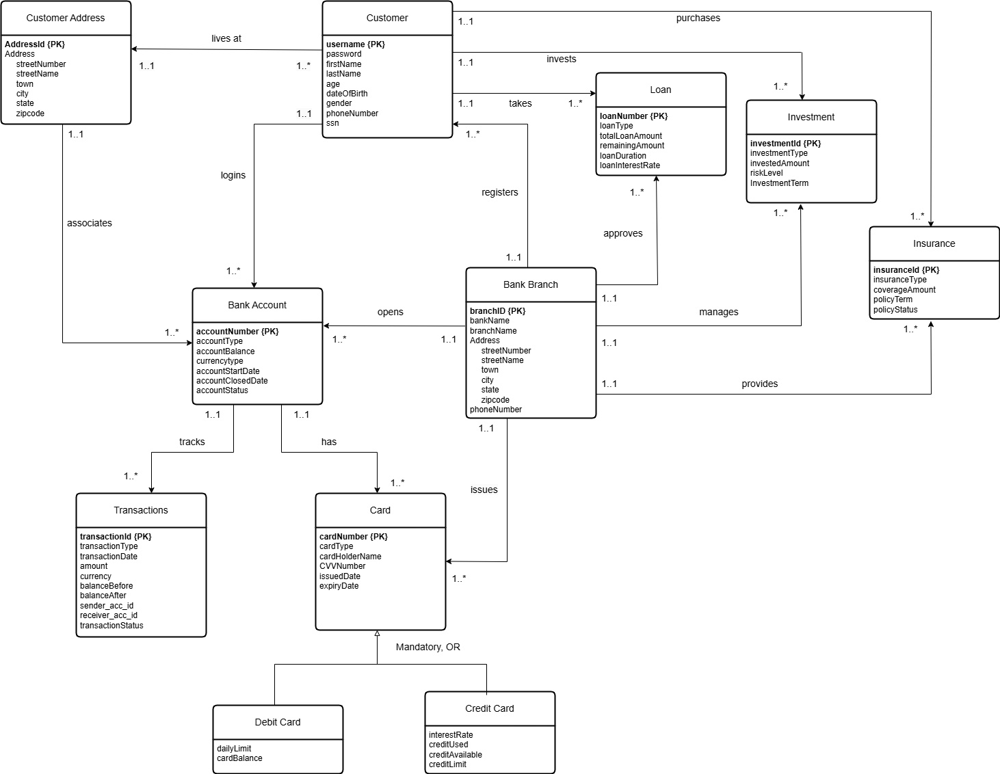
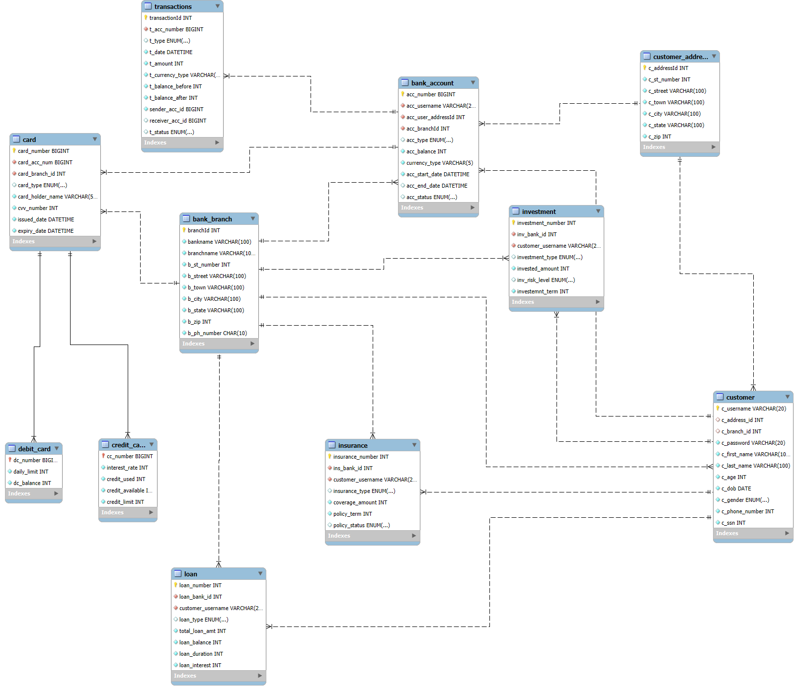

# Bank-Database-Management-System
Project Name: Bank Database Management System

## Team Members

- **Harish Nandha Kumar**
- **Lin Pyae Toe**

## Description

This Python-MySQL banking system utilizes PyMySQL and stored procedures. It features user registration, secure login, account management, transactions, loans, insurance, investments functions which makes this a solid backend prototype for scalable, user-friendly financial apps.

## UML Diagram


## Reverse Engineered Schema


## Setup Instructions
##### Database Setup
1. Install MySQL (version 8.0 or higher).
2. Execute the provided SQL scripts (bank db project.sql and procedures.sql) in the MySQL Workbench to create the database and stored procedures.
3. Import the bank db project database using the following command:
   ```bash
   mysql -u root -p < bank_db_project.sql
   ```
#### Python Environment
1. Install Python (version 3.9 or higher)
2. Set up a virtual environment:
   ```bash
   python3 -m venv venv
   source venv/bin/activate # On Windows: venv\Scripts\activate
   ```
3. Install required dependencies:
   ```bash
   pip install pymysql
   ```
## Project Files
Ensure the following project structure:
- src/
  - account.py
  - insurance.py
  - investment.py
  - loan.py
  - register.py
  - transaction.py
  - bank_db_project.sql
  - procedures.sql

## Running the Application
1.  Launch the main application by running: python main.py
2.  Follow the prompts for user actions.

## Required Software
- **MySQL**: MySQL Community Downloads
- **Python**: Python Downloads

## Technical Specifications
- **Host Language**: Python 3.9
- **Database**: MySQL 8.0
- **Frameworks and Libraries**:
   - pymysql for database connectivity.
   – Python’s built-in modules: datetime, random
- **Development Tools**:
   - MySQL Workbench for schema design and reverse engineering
   - PyCharm/VS Code for Python development
- **Operating System**: Tested on Windows 10 and Ubuntu 20.04

## User Flow
#### User Actions
1. **Register**:
   - Execute register user details and register user address procedures.
   - User provides personal and address details.
   - System assigns a branch and generates an account.
2. **Sign In**:
   - Validate user credentials using the 'SignIn' function.
3. **Account Management**:
   - Create Account: Initiates a new account with a deposit, debit, and credit card.
   - Deposit Amount: Updates account balance using 'insert create new account'.
4. **Transactions**:
   - Transfer Funds: Validates sender and receiver details and executes a transfer.
5. **Loan Management**:
   - Apply for a loan: Execute 'insert new loan'.
   - Pay a loan: Update loan balance using 'update loan balance'.
6. **Investment and Insurance**:
   - Apply/Delete Investments using 'add investment' or 'delete investment'.
   - Apply/Delete Insurance using 'add insurance' or 'delete insurance'.

## Technical Expertise Gained:
Working on this project provided us with valuable technical skills and practical experience. Specifically, we expanded our knowledge in Python and
SQL, learning how to integrate Python programs with a SQL database effectively. This skill is crucial for developing dynamic and interactive database
management systems that enhance the user experience.
